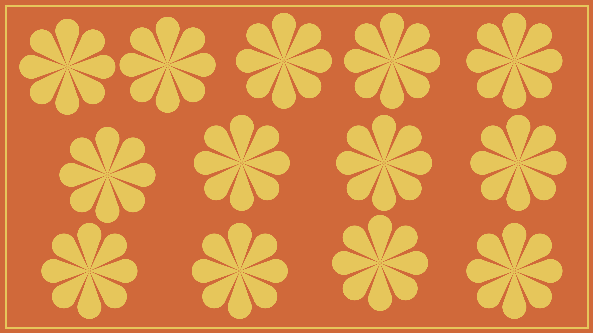

# Learn to Create Flowers Grid in CSS

Over the weekend, I decided to explore CSS shapes and attempted to create a flower using circles and triangles. In my upcoming blog post, I'll share a step-by-step guide on how to create a flower using simple shapes in CSS. To give you a sneak peek, you can take a look at my Flower grid page design below.



## Let's start with the basics

Create a basic HTML file named index.html in your project folder. If you are using VS code type `!` and it will create a basic HTML file for you or you can copy-paste the following code.

Note: You don't need to do this step if you are using an online editor like codepen.io.

I will write all of your code inside of the `<body>` tag.

Next, create a CSS file, styles.css. I will add all of our styling in this file. Before starting coding, don't forget to add your CSS file to the HTML file. You can do this by adding the following line inside the `<head>` tag.

```html
<link rel="stylesheet" href="styles.css" />
```
## Create a basic HTML layout
First, you need to create multiple divs in the HTML file. Here's the process you can follow.

- Create divs
- Add a class or ID to these divs
- Use these selectors (class/id) to add CSS
- Make shapes

Here's the HTML layout I used.

```html
<div id="container">
  <div class="flower">
      <div class="petal">
            <div class="circle"></div>
            <div class="triangle"></div>
      </div>
      <div class="petal">
          <div class="circle"></div>
          <div class="triangle"></div>
      </div>
      <div class="petal">
          <div class="circle"></div>
          <div class="triangle"></div>
      </div>
      <div class="petal">
          <div class="circle"></div>
          <div class="triangle"></div>
      </div>
      <div class="petal">
          <div class="circle"></div>
          <div class="triangle"></div>
      </div>
      <div class="petal">
          <div class="circle"></div>
          <div class="triangle"></div>
      </div>
      <div class="petal">
          <div class="circle"></div>
          <div class="triangle"></div>
      </div>
      <div class="petal">
          <div class="circle"></div>
          <div class="triangle"></div>
      </div>
      <div class="petal">
          <div class="circle"></div>
          <div class="triangle"></div>
      </div>
  </div>
</div>
```
Let's first understand what I did here.

1. I created the first div with an id `"container"` because I want to add a border to my page and this `div` will help me do that.

2. Next, I created a `div` to display the complete flower. This div will help me make a complete flower using lots of petals of a flower.

3. I will use the `"petal"` class to make one petal of the flower. Multiple uses of `div`s will help me make a complete flower. This `div` will help us keep the circle and triangle of a petal combined.

4. Next, I combine the circle and triangle shapes to make a flower petal.

## Let's add CSS

To add CSS, we will add the styling to innermost selectors first then eventually add CSS to parent divs. This will help us align the CSS according to our needs.

### First, add a border to your web page

Let's give our page a colorful background and border to make it look aesthetic. You can give whatever color you want to give your page.

```css
body{
    background-color: #DF6229;
    width: 100%;
    height: 100%;
}

#container{
    margin: 20px;
    border: 5px solid #EDC442;
    padding: 20px;
    height: 760px;
    display: flex;
}
```

### Let's start with creating a circle first
First of all, I will create a circle using CSS. You can create a circle by defining four CSS properties.
- `background`: Background color helps differentiate the circle from its parent object.
- `border-radius`: If we define the radius of the border to 50%, we can give the border a circular shape. You can also keep your border solid, but for our flower use case, I am not going to define it.
- `width` and `height`: Witdh and height define the size of the circle. Remember, we need to keep both of them of the same size.

Let's look at the CSS code.

```css
.circle {
    background: #EDC442;
    border-radius: 50%;
    width: 60px;
    height: 60px;
}
```
### Let's create a triangle now

To create a triangle, I will use borders. In CSS, border edges on an element are 45-degree diagonals to each other. So, by making one of the borders of solid color and the other two transparent, it creates a perfect triangle. For our use case, we need a triangle attached to a circle, where the arrow points in the opposite direction to the circle.
Let's look at the code first.

```css
.triangle {
    margin-top: -20px;
    width: 0;
    height: 0;
    border-top: 80px solid #EDC442;
    border-left: 28px solid transparent;
    border-right: 28px solid transparent;   
}
```

Now, let me explain to make it easy for you.

- `margin-top`: I am reducing the top margin to combine the circle and triangle fully, otherwise, the triangle will not come on top of the circle and will remain as a separate element.
- `width` and `height`: I am keeping the width and height `0` because the border will define the width and height for our triangle.
- `border`: I used three different border properties to define three sides of the triangle. The top side gets attached to the circle and the left and right sides are transparent to give an arrow look to the triangle.

### Now, we need to make a petal
Petals will not only keep the circle and triangle intact with each other, but they will also help shape the flower and create multiple petals of a flower circularly. Let's look at the code first.

```css
.petal{
    position: absolute;
    display: flex;
    flex-direction: column;
    align-items: center;
    transform-origin: center 120px;
}
```

Let's understand the code now.

- `position`: `absolute` position will allow us to wrap all of the petals together.
- `display` and `flex-direction`: Both of these properties help align circles and triangles in column direction.
- `align-items`: Aligning the circle and triangle to the center helps make a perfect petal. Try removing this property and you will see the difference.
- `transform-origin`: Transform origin plays an important role in making petals appear circular. It is the point around which an element transforms. For example, the `rotate` function has a center of rotation `transform-origin`, which we will use for our flower.

### Let's rotate the petals now
Remember we defined multiple petals in our HTML file. Now, we need to rotate them in a circular form with a center origin. Let's see how we can do that.

```css
.petal:nth-child(1) {
    transform: rotate(45deg);
}

.petal:nth-child(2) {
    transform: rotate(65deg);
}

.petal:nth-child(2) {
    transform: rotate(90deg);
}

.petal:nth-child(3) {
    transform: rotate(135deg);
}

.petal:nth-child(5) {
    transform: rotate(180deg);
}

.petal:nth-child(6) {
    transform: rotate(225deg);
}

.petal:nth-child(7) {
    transform: rotate(270deg);
}

.petal:nth-child(8) {
    transform: rotate(315deg);
}

.petal:nth-child(9) {
    transform: rotate(360deg);
}
```

### Create multiple flowers

Now, here's something for you to do. We've completed most of the flowers grid, and now it's your turn to try creating multiple flowers on the grid on your own. This is a great way to practice using CSS and to come up with something unique.
Hint: Copy and paste the `flower` `div` multiple times and add CSS to the child to set the position of the flowers using a property, just like petals.

## That's a wrap
In this tutorial, you learned:
- To create a circle in CSS
- To create a triangle in CSS
- To create a flower using two shapes
- To rotate multiple divs using the rotate property
